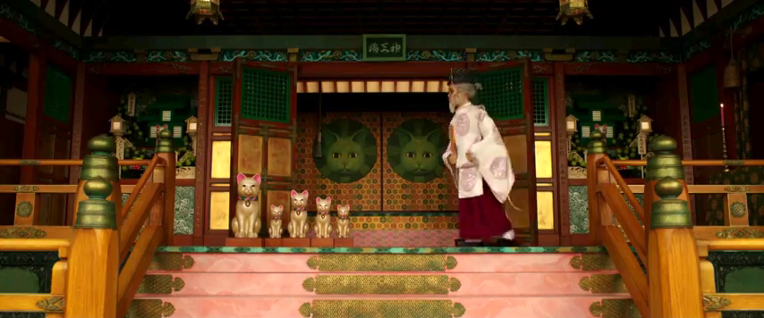
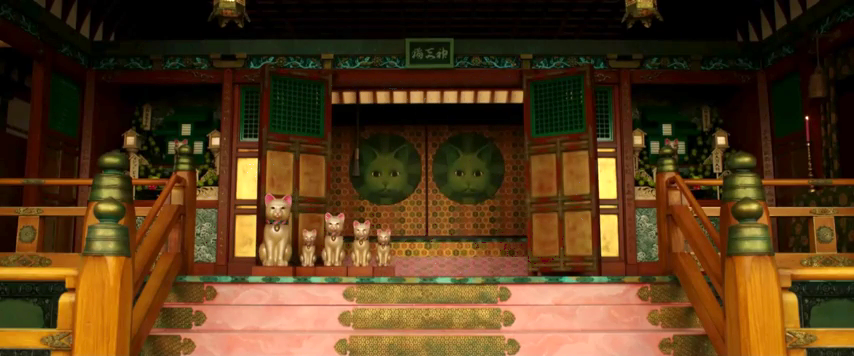

# Just a fun python image processor that takes a set of images and finds what's consistant
Works best if you've got a set of images that are static, besides something moving through them-
it'll automatically produce an image without whatever's going through them

Coded as part of an assignment for CST  205- Multimedia Programming and Design

# Before

# After
